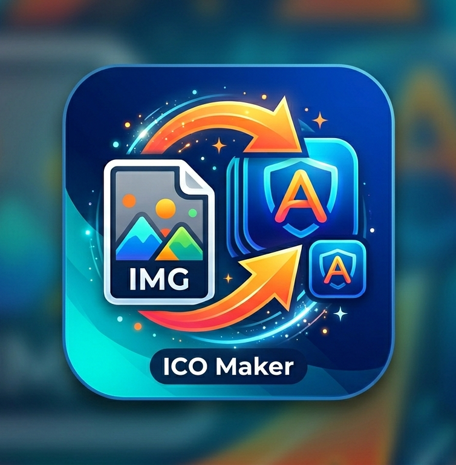

# img2ico - Image to ICO Converter

A simple Windows desktop application to convert images (PNG, JPG, BMP, GIF) to ICO format with multiple icon sizes.

## Features

- **Drag & Drop**: Easily add images by dragging them into the application
- **Batch Conversion**: Convert multiple images at once
- **Multiple Sizes**: Creates ICO with 7 sizes (16, 24, 32, 48, 64, 128, 256 pixels)
- **Simple GUI**: Clean, intuitive interface with the app's signature color scheme
- **Standalone**: No installation required - runs as a single executable

## Requirements

- Windows 10/11 (64-bit)
- No additional dependencies needed (standalone executable)

## Usage

1. Run `img2ico.exe`
2. Drag & drop images or click to browse
3. Select output folder
4. Click "Convert to ICO"
5. ICO files are saved in the selected folder

## Supported Formats

- PNG
- JPG/JPEG
- BMP
- GIF

## Output

Creates multi-resolution ICO files suitable for Windows applications, containing these sizes:
- 16x16
- 24x24
- 32x32
- 48x48
- 64x64
- 128x128
- 256x256

## License

MIT License
